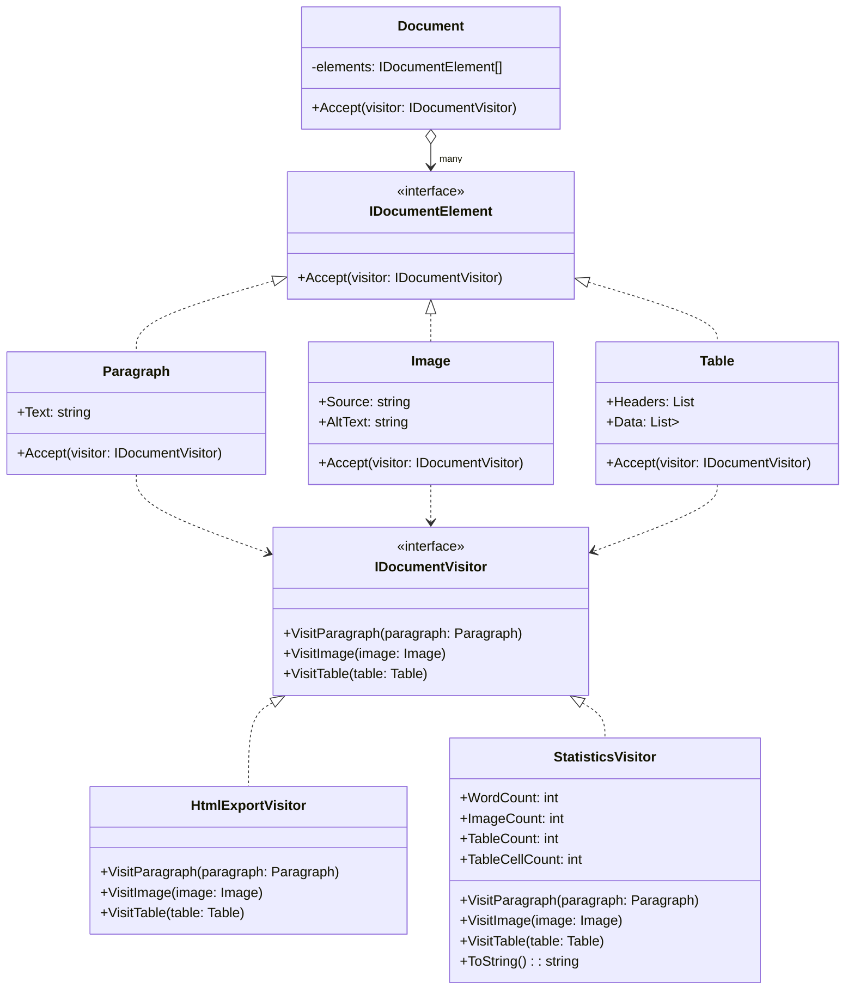

# Visitor Pattern

## Intent

Represents an operation to be performed on elements of an object structure without changing the classes of the elements on which it operates.

## Problem

Imagine you have a document object structure with different elements like:

- Paragraphs
- Images
- Tables

And you want to perform different operations on these elements, like:

1. Export them to HTML
2. Export them to PDF
3. Count word statistics

## Solution

The Visitor pattern suggests placing the new behavior in a separate class called a visitor, instead of trying to integrate it into existing classes.

## Structure

The Visitor pattern consists of several key components working together:

### Core Interfaces

1. `IDocumentElement` - The element interface that all document elements must implement
   - Declares an `Accept` method that takes a visitor
2. `IDocumentVisitor` - The visitor interface that all visitors must implement
   - Declares `Visit` methods for each type of element

### Document Elements

1. `Document` - The object structure containing multiple elements

   - Maintains a collection of `IDocumentElement`
   - Implements traversal logic to visit each element

2. Concrete Elements (all implement `IDocumentElement`):
   - `Paragraph` - Contains text content
   - `Image` - Contains source and alt text
   - `Table` - Contains headers and data rows

### Visitors

Concrete Visitors (all implement `IDocumentVisitor`):

1. `HtmlExportVisitor`
   - Converts each element to HTML format
   - Maintains clean separation of HTML generation logic
2. `StatisticsVisitor`
   - Counts words, images, and table statistics
   - Accumulates state across multiple visits

### Key Relationships

1. Element-Visitor Double Dispatch:
   - Elements accept visitors through their `Accept` method
   - Visitors visit elements through their `Visit` methods
2. Hierarchy:
   - Multiple concrete elements inherit from `IDocumentElement`
   - Multiple concrete visitors inherit from `IDocumentVisitor`
3. Dependencies:
   - Elements depend on the visitor interface (not concrete visitors)
   - Document aggregates multiple elements



## Benefits

1. **Open/Closed Principle**: Add new operations without modifying element classes
2. **Single Responsibility Principle**: Related behaviors are grouped in visitor classes
3. **Accumulating State**: Visitors can maintain state as they visit elements
4. **Clean Element Classes**: Elements focus on their primary responsibility

## When to Use

- When you need to perform operations on elements of an object structure
- When you have many distinct and unrelated operations to perform
- When the object structure classes rarely change, but you often want to define new operations
- When related operations should be grouped together rather than spread across element classes

## Real-World Analogy

Think of a building inspector visiting different rooms in a building:

- Each room (element) knows its own properties
- The inspector (visitor) performs specific checks in each room
- New types of inspections can be added without changing room definitions

## Implementation

1. Add new elements (like Table) to the structure
2. Have visitors handle the new element type
3. Keep element and visitor responsibilities separate

## Example Usage

```csharp
// Create document with various elements
var document = new Document();

// Export to HTML
var htmlVisitor = new HtmlExportVisitor();
document.Accept(htmlVisitor);

// Get statistics
var statsVisitor = new StatisticsVisitor();
document.Accept(statsVisitor);
Console.WriteLine(statsVisitor.ToString());
```
