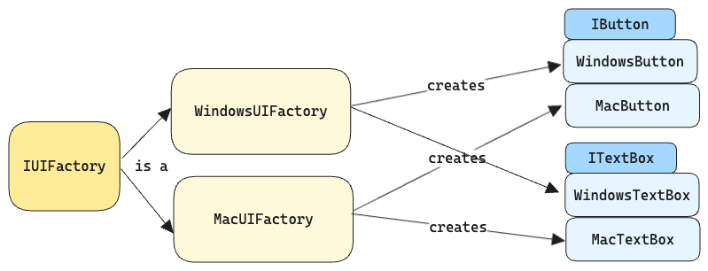
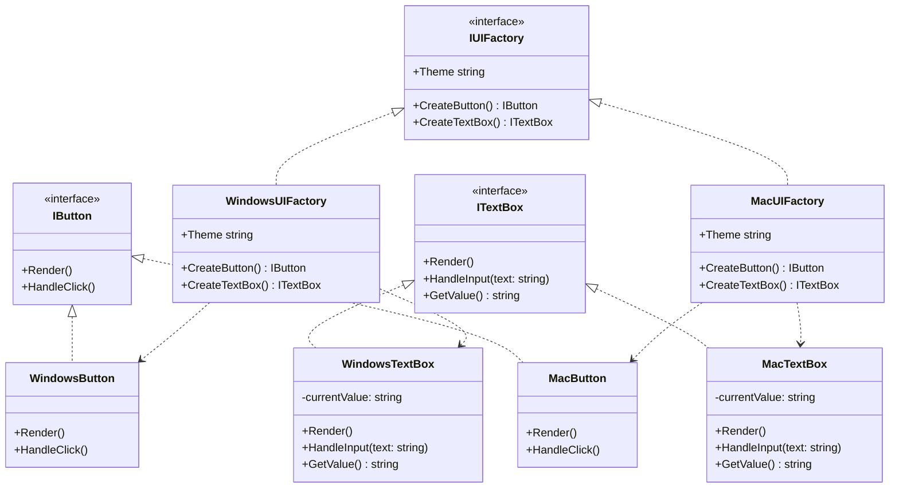

# Abstract Factory Pattern

## Intent

Provides an interface for creating families of related or dependent objects without specifying their concrete classes.

## Problem

How do we create a UI framework that works consistently across different operating systems while maintaining platform-specific look and feel?

## Solution

The Abstract Factory pattern suggests:

1. Explicitly declare interfaces for each distinct product (e.g., button, textbox)
2. Make each variant of the product follow those interfaces
3. Declare an abstract factory interface with methods for creating each product
4. Implement a factory class for each product variant (e.g., Windows, macOS)

## Structure





## Implementation

### 1. Product Interfaces

- `IButton`: Defines common button behavior
- `ITextBox`: Defines common textbox behavior

### 2. Concrete Products

- Windows variants: `WindowsButton`, `WindowsTextBox`
- macOS variants: `MacButton`, `MacTextBox`

### 3. Abstract Factory

- `IUIFactory`: Declares creation methods for each product

### 4. Concrete Factories

- `WindowsUIFactory`: Creates Windows-styled controls
- `MacUIFactory`: Creates macOS-styled controls

## Usage Example

```csharp
// Create a factory for the desired platform
IUIFactory factory = new WindowsUIFactory();

// Create UI components using the factory
IButton button = factory.CreateButton();
ITextBox textBox = factory.CreateTextBox();

// Use the components
button.Render();
textBox.HandleInput("Hello World!");
```

## When to Use

| Use Case                        | Keywords                                                              | Example                                                                    |
| ------------------------------- | --------------------------------------------------------------------- | -------------------------------------------------------------------------- |
| Family of Related Products      | "suite", "collection", "set of matching", "coordinated", "compatible" | UI controls that must match in style and behavior                          |
| Platform/Environment Variations | "cross-platform", "multi-region", "environment-specific"              | AWS/Azure/GCP cloud services with similar capabilities                     |
| Complete System Switching       | "switch entirely", "all components change together"                   | Switching from PDF to Word document generation where all parts must change |
| Strict Component Compatibility  | "must work together", "interdependent", "coordinated"                 | Game character classes where weapons and armor must match                  |

## When NOT to Use

Key Questions to Ask:

1. Family Requirement

   ✅ Do the products need to work together as a cohesive unit?

   ❌ Can the products work independently?

   ```csharp
   // MISUSE: Validators usually work independently
    public interface IValidatorFactory
    {
        IEmailValidator CreateEmailValidator();
        IPasswordValidator CreatePasswordValidator();
    }

    // BETTER: Use composite or chain of responsibility
    public class ValidationChain
    {
        public void AddValidator(IValidator validator);
    }
   ```

   ```csharp
   // MISUSE: Often doesn't need family of products
    public interface IDataFactory
    {
        IRepository CreateRepository();
        IUnitOfWork CreateUnitOfWork();
    }

    // BETTER: Use Repository pattern directly
    public interface IRepository<T>
    {
        T GetById(int id);
    }
   ```

2. Consistency Requirement

   ✅ Must all products follow the same theme/rules/platform?

   ❌ Can products vary independently?

3. Independent Products

   ✅ Do all components need to change together?

   ❌ Do components change independently?

   ```csharp
   // BAD: Products don't need to be related
    public interface IUtilityFactory
    {
        IEmailSender CreateEmailSender();
        IFileCompressor CreateCompressor();  // No relation to email
    }

    // BETTER: Create separately
    public class EmailSender { }
    public class FileCompressor { }
   ```

4. Complexity Justification

   ✅ Is the complexity of Abstract Factory warranted by the system requirements?

   ❌ Could this be solved with simpler patterns?

   ```csharp
   // BAD: Overengineered for simple differences
   public interface IReportFactory
   {
       IHeader CreateHeader();
       IContent CreateContent();
   }

   // BETTER: Use strategy pattern or simple inheritance
   public abstract class Report
   {
       public virtual void GenerateHeader() { }
         public virtual void GenerateContent() { }
   }
   ```

If you answer "no" to two or more of these questions, consider alternative patterns like:

- Simple Factory
- Builder Pattern
- Strategy Pattern
- Dependency Injection
- Factory Method

## Real-World Analogies

1. **Car Manufacturing**: Different factories produce different car brands, each with compatible parts
2. **Furniture Store**: Different collections (modern, classic) with matching pieces
3. **UI Frameworks**: Cross-platform UI toolkits with native look and feel
