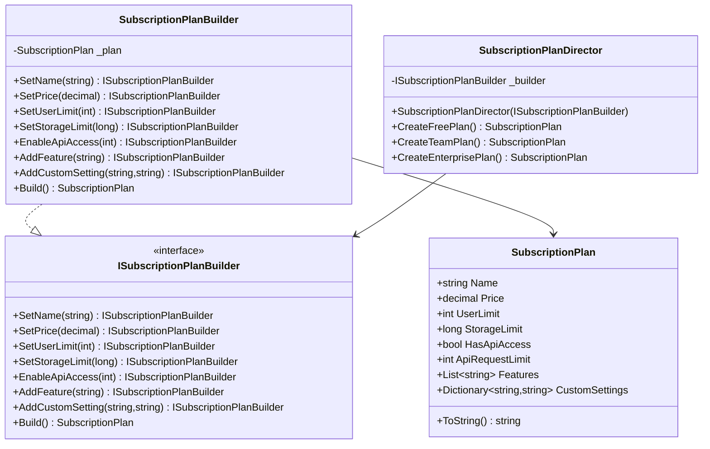
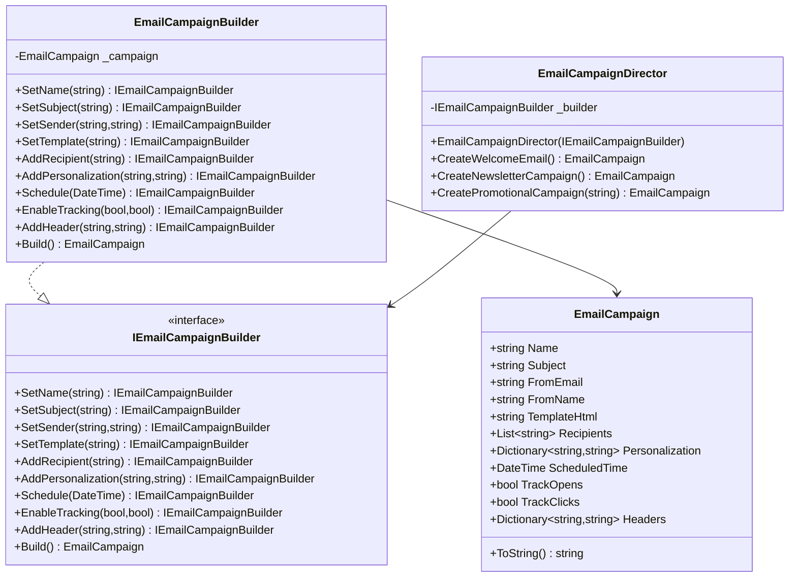

# Builder Pattern

## Intent

Separates the construction of a complex object from its representation, allowing the same construction process to create different representations.

## Problem

How do we create complex objects with many optional parameters while keeping the code maintainable and avoiding "telescoping constructors"?

## Solution

The Builder pattern suggests:

1. Extract the object construction code into separate builder objects
2. Create a step-by-step construction process
3. Use method chaining (fluent interface) for readable configuration
4. Optionally use a director to define common construction sequences

## When to Use

Use the Builder pattern when:

- Object construction involves multiple steps
- Objects have many optional parameters
- Different representations of the object are needed
- Construction process should be independent of the parts
- Fine control over the construction process is needed

Don't use when:

- Objects have few parameters
- All parameters are required
- No variation in the construction process is needed
- The object structure is simple

## Benefits

1. **Step-by-step Construction**: Build objects piece by piece
2. **Fluent Interface**: Readable and maintainable code
3. **Flexible Configuration**: Many optional parameters
4. **Reusable Components**: Same construction process for different representations
5. **Single Responsibility**: Separates construction from business logic

## Real-World Use Cases

1. **SaaS Products**:

   - Subscription plans
     A subscription management system that needs to create various pricing tiers with different features:

   - Different user limits
   - Storage quotas
   - API access levels
   - Feature sets
   - Custom settings

   - Feature toggles
   - User permissions
   - Integration settings

2. **Email Systems**:
   An email marketing system that builds complex email campaigns with:

   - Campaign builders
   - Template engines
   - Recipient lists
   - Personalization
   - Scheduling
   - Tracking options
   - Custom headers
   - Notification systems

3. **Configuration Systems**:
   - Application settings
   - User preferences
   - System configurations

## Implementation Notes

1. Start with the Product class
2. Create the Builder interface
3. Implement Concrete Builders
4. Create a Director (optional)
5. Use method chaining for better readability
6. Consider making builders immutable
7. Add validation in the Build() method

## Example Usage

```csharp
// Creating a Team subscription plan
var planBuilder = new SubscriptionPlanBuilder();
var director = new SubscriptionPlanDirector(planBuilder);
var teamPlan = director.CreateTeamPlan();

// Custom plan using fluent interface
var customPlan = new SubscriptionPlanBuilder()
    .SetName("Custom")
    .SetPrice(299.99m)
    .SetUserLimit(50)
    .SetStorageLimit(500)
    .EnableApiAccess(50000)
    .AddFeature("Custom Support")
    .Build();
```

## UML Diagrams

### 1. Subscription Plan Builder



### 2. Email Campaign Builder



Both implementations follow the Builder pattern structure but demonstrate different use cases:

1. **Subscription Plan Builder**:

   - Focuses on configuring service tiers with features and limits
   - Uses the Director to create standard subscription plans
   - Allows custom plan creation through fluent interface

2. **Email Campaign Builder**:
   - Handles email campaign configuration with multiple settings
   - Uses the Director to create common email types
   - Supports custom campaign creation with tracking and scheduling
