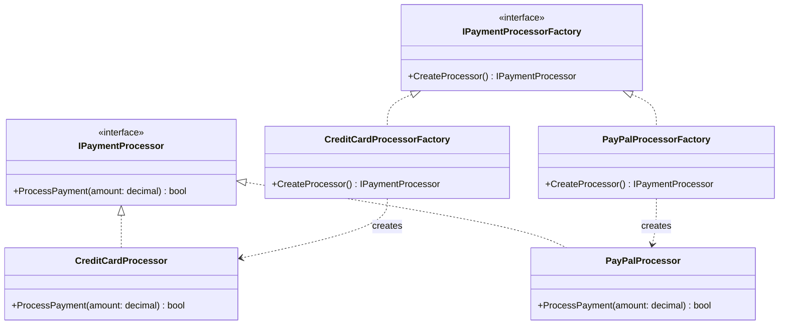

# Payment Processing System

## Overview

This implementation demonstrates the Factory Method pattern using a payment processing system. The system supports multiple payment methods (Credit Card, PayPal) while maintaining a consistent interface for processing payments.

## Structure



## Components

1. **Product Interface**

   - `IPaymentProcessor`: Defines the interface for payment processing
   - Methods: `ProcessPayment(decimal amount)`

2. **Concrete Products**

   - `CreditCardProcessor`: Handles credit card payments
   - `PayPalProcessor`: Handles PayPal payments

3. **Creator Interface**

   - `IPaymentProcessorFactory`: Declares the factory method
   - Methods: `CreateProcessor()`

4. **Concrete Creators**
   - `CreditCardProcessorFactory`: Creates credit card processors
   - `PayPalProcessorFactory`: Creates PayPal processors

## Usage Example

```csharp
// Create factories
var creditCardFactory = new CreditCardProcessorFactory();
var paypalFactory = new PayPalProcessorFactory();

// Create processors using factories
var creditCardProcessor = creditCardFactory.CreateProcessor();
var paypalProcessor = paypalFactory.CreateProcessor();

// Process payments
creditCardProcessor.ProcessPayment(100.00m);  // Output: Processing credit card payment of $100.00
paypalProcessor.ProcessPayment(50.00m);       // Output: Processing PayPal payment of $50.00
```
