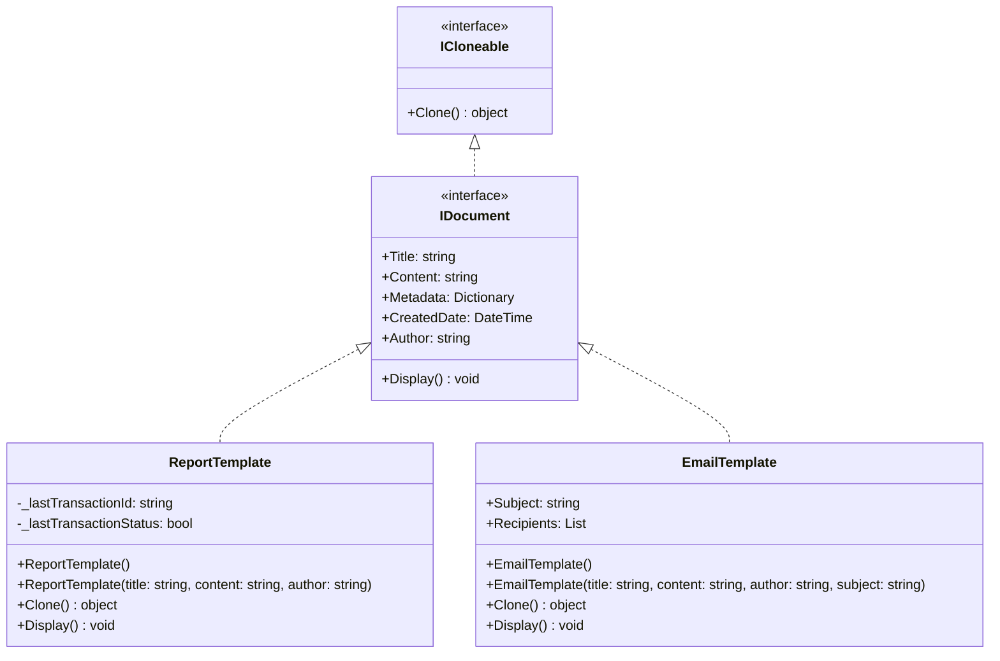

# Document Template System

## Overview

This implementation demonstrates the Prototype pattern using a document template system that handles different types of documents (reports and emails). This is a common real-world scenario where you want to create multiple variations of a base template.

## Structure

- `IDocument` (Prototype): Interface that declares the cloning method
- `ReportTemplate` (Concrete Prototype): Business report template with specific attributes
- `EmailTemplate` (Concrete Prototype): Email template with additional email-specific properties

## UML Diagram



## Class Responsibilities

1. **IDocument (Prototype Interface)**

   - Extends ICloneable for object copying
   - Defines common properties for all documents
   - Declares Display() method for output

2. **ReportTemplate (Concrete Prototype)**

   - Implements basic document functionality
   - Provides deep cloning of all properties
   - Formats output as a business report

3. **EmailTemplate (Concrete Prototype)**
   - Extends basic document properties
   - Adds email-specific fields (Subject, Recipients)
   - Provides deep cloning including recipient list
   - Formats output as an email template

## Key Relationships

- Both concrete classes implement IDocument interface
- IDocument extends ICloneable for prototype functionality
- Each concrete class provides its own Clone() implementation
- All classes share common document properties
- Each concrete class adds specialized properties and behavior

## Usage Example

```csharp
// Create original template
var reportTemplate = new ReportTemplate(
    "Monthly Sales Report",
    "This report summarizes the monthly sales performance...",
    "John Doe"
);
reportTemplate.Metadata.Add("Department", "Sales");

// Clone and customize
var quarterlyReport = (ReportTemplate)reportTemplate.Clone();
quarterlyReport.Title = "Quarterly Sales Report";
quarterlyReport.Metadata["Period"] = "Quarterly";

// Both templates can be used independently
reportTemplate.Display();
quarterlyReport.Display();
```
