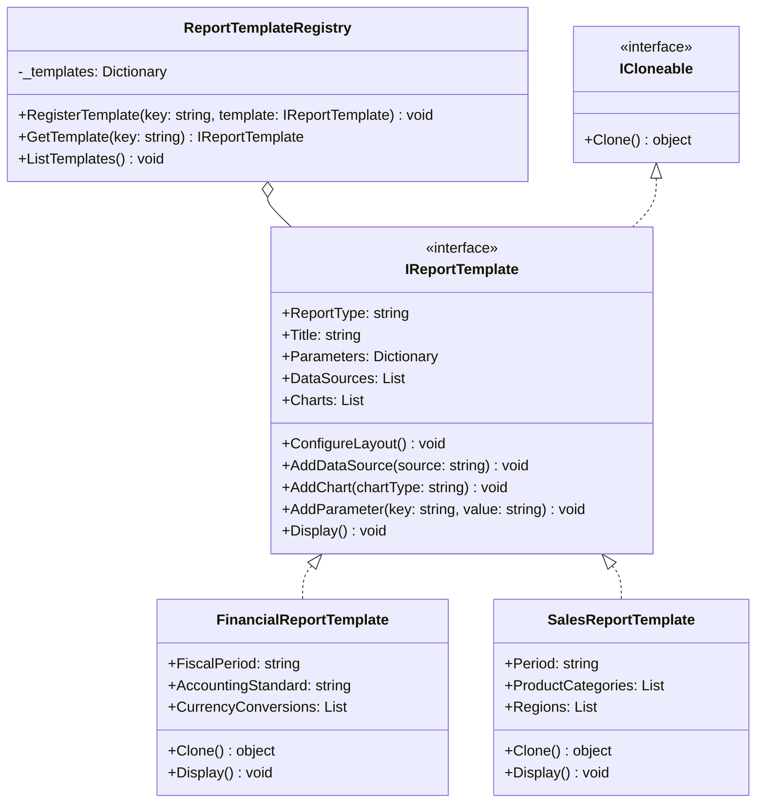

# Report Generation System

## Overview

This implementation demonstrates an advanced use of the Prototype pattern in a report generation system. It showcases how to manage multiple report templates through a centralized registry and create customized reports through cloning.

## Structure

- `IReportTemplate` (Prototype): Interface for all report templates
- `ReportTemplateRegistry`: Central manager for report prototypes
- Report Types:
  - `FinancialReportTemplate`: Financial statements and analysis
  - `SalesReportTemplate`: Sales performance and metrics

## UML Diagram



## Class Responsibilities

1. **IReportTemplate (Prototype Interface)**

   - Defines common report properties and methods
   - Extends ICloneable for prototype functionality
   - Provides methods for configuration and display

2. **ReportTemplateRegistry (Template Manager)**

   - Maintains a collection of report templates
   - Handles template registration and retrieval
   - Provides template listing functionality

3. **FinancialReportTemplate**

   - Specialized for financial reporting
   - Includes fiscal period and accounting standards
   - Handles currency conversions

4. **SalesReportTemplate**
   - Focused on sales performance reporting
   - Manages product categories and regions
   - Supports regional sales analysis

## Key Features

1. **Centralized Template Management**

   - Templates are registered with unique keys
   - Easy access to available templates
   - Runtime template registration support

2. **Deep Cloning**

   - All collections are deep copied
   - Template-specific properties are preserved
   - Independent customization of clones

3. **Flexible Configuration**
   - Support for multiple data sources
   - Customizable charts and parameters
   - Specialized properties per report type

## Usage Example

```csharp
// Create and configure registry
var registry = new ReportTemplateRegistry();

// Create and register financial template
var financialTemplate = new FinancialReportTemplate
{
    Title = "Quarterly Financial Report",
    FiscalPeriod = "Q2 2025",
    AccountingStandard = "IFRS"
};
financialTemplate.AddParameter("Department", "Finance");
financialTemplate.AddChart("BalanceSheet");
registry.RegisterTemplate("quarterly_financial", financialTemplate);

// Clone and customize template
var customReport = (FinancialReportTemplate)registry.GetTemplate("quarterly_financial");
customReport.Title = "Annual Financial Report 2025";
customReport.FiscalPeriod = "FY 2025";
customReport.AddChart("CashFlow");
customReport.Display();
```

## Benefits

1. **Template Reusability**

   - Base templates can be reused for multiple reports
   - Maintains consistency across reports
   - Reduces template creation overhead

2. **Flexible Customization**

   - Each clone can be independently modified
   - Supports different reporting periods
   - Allows for specialized configurations

3. **Centralized Management**
   - Single point of template access
   - Easy template updates and maintenance
   - Runtime template registration
