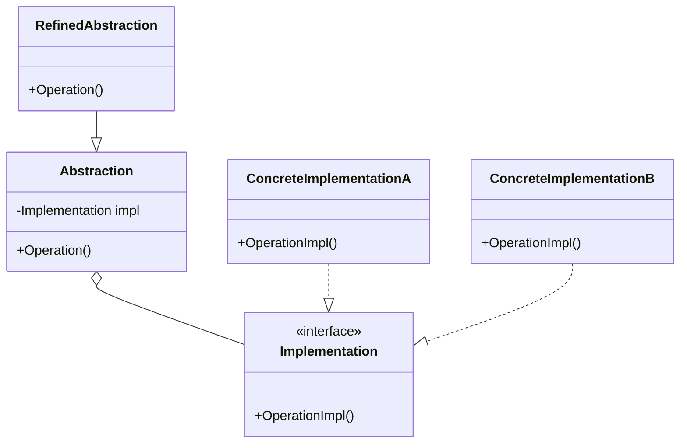
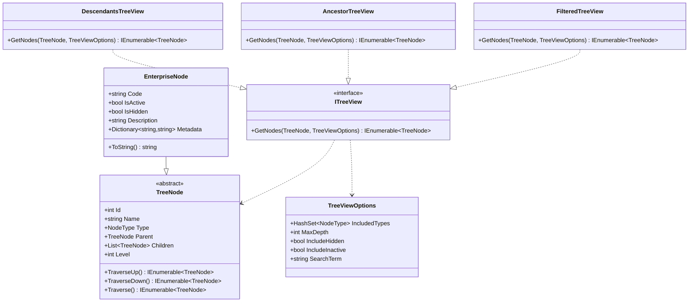

# Bridge Pattern

## Intent

Decouples an abstraction from its implementation so that the two can vary independently. This pattern involves an interface which acts as a bridge between two independent components.

## Problem

How do we handle different variations of a component without creating an explosion of classes? For example, how can we have different views of the same tree structure without tightly coupling the tree implementation with its presentation?

## Solution

The Bridge pattern suggests splitting a large class or set of closely related classes into two separate hierarchies:

1. Abstraction (interface)
2. Implementation

This separation allows both hierarchies to change independently.

## Real-World Example

### Enterprise Organization Tree

An enterprise organization tree that needs different views and traversal methods:

- Department hierarchy view
- Team structure view
- Project-based view
- Different filtering and depth options
- Various traversal methods (up/down/filtered)

## Structure



## When to Use

✅ Use the Bridge pattern when:

- You want to avoid permanent binding between an abstraction and its implementation
- Both the abstractions and implementations should be extensible through subclassing
- Changes in the implementation shouldn't impact client code
- You want to share an implementation among multiple objects

❌ Don't use when:

- You have a simple class hierarchy
- You don't expect the implementation to change
- You don't need to vary the abstraction and implementation independently

## Benefits

1. **Decoupling Interface and Implementation**: Changes to one don't affect the other
2. **Better Extensibility**: New abstractions and implementations can be added independently
3. **Hiding Implementation Details**: Clients don't need to know about the implementation
4. **Runtime Flexibility**: Implementation can be switched at runtime
5. **Single Responsibility**: Separates interface from implementation concerns

## Implementation Notes

1. Start with the abstraction and implementation interfaces
2. Create concrete implementations
3. Define refined abstractions if needed
4. Use composition over inheritance
5. Consider lazy initialization of the implementation
6. Plan for future extensions

## Example Implementation

### Enterprise Tree UML



## Example Usage

```csharp
// Create the tree structure
var root = new EnterpriseNode("Enterprise Corp", NodeType.Department);
var engineering = new EnterpriseNode("Engineering", NodeType.Department);
root.Children.Add(engineering);

// Configure view options
var options = new TreeViewOptions
{
    IncludedTypes = new HashSet<NodeType> { NodeType.Department, NodeType.Team },
    MaxDepth = 2
};

// Use different views of the same tree
var filteredView = new FilteredTreeView();
var filteredNodes = filteredView.GetNodes(root, options);

var ancestorView = new AncestorTreeView();
var ancestors = ancestorView.GetNodes(engineering, options);
```

## Real-World Use Cases

1. **Organization Structures**:

   - Department hierarchies
   - Team structures
   - Project organizations
   - Resource allocations

2. **Document Systems**:

   - Different document views
   - Various formatting options
   - Multiple export formats

3. **UI Frameworks**:

   - Platform-specific implementations
   - Theme variations
   - Layout managers

4. **Data Access**:
   - Multiple database providers
   - Different storage formats
   - Caching strategies
